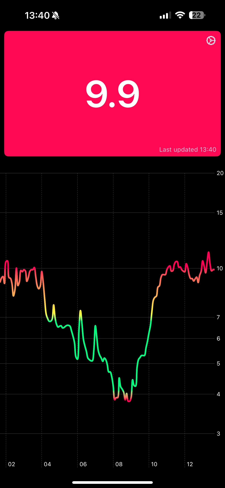
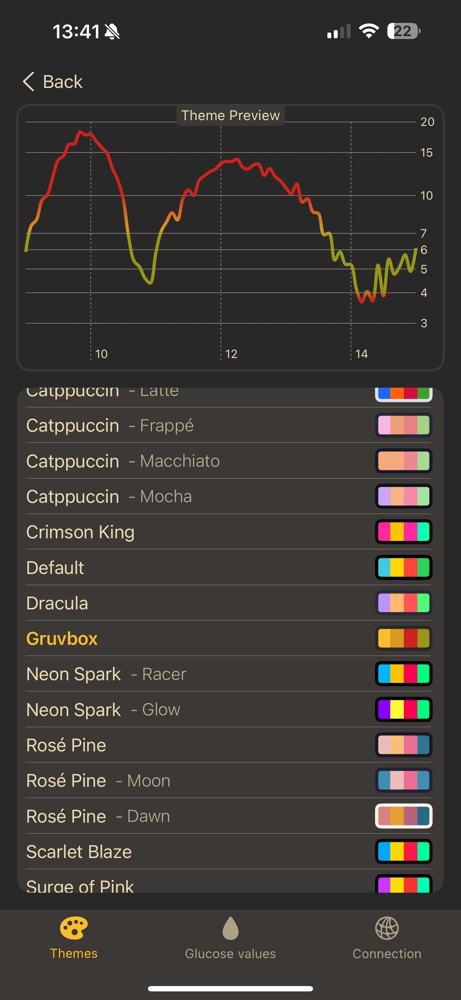
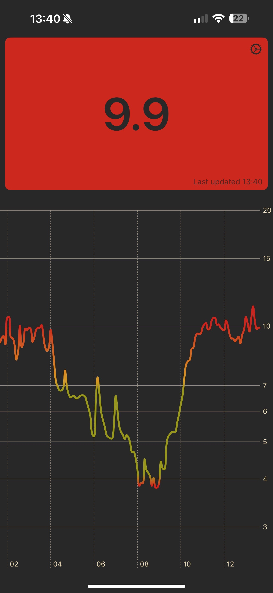

# GlucoScope

GlucoScope is a highly customizable native iOS and Android app for diabetics to display & track their blood glucose levels and visualize them with pretty graphs. It's fully compatible with NightScout servers, but can connect a custom Rust server that leverages InfluxDB to store time series data.

[![AppStore][appstore-image]][appstore-url]

## Screenshots

|    |   |  |
|---------------------|---------------------------|-------------------|

## Stats

[appstore-image]: docs/appstore.png
[appstore-url]: https://apps.apple.com/us/app/glucoscope/id6745609594?platform=iphone
